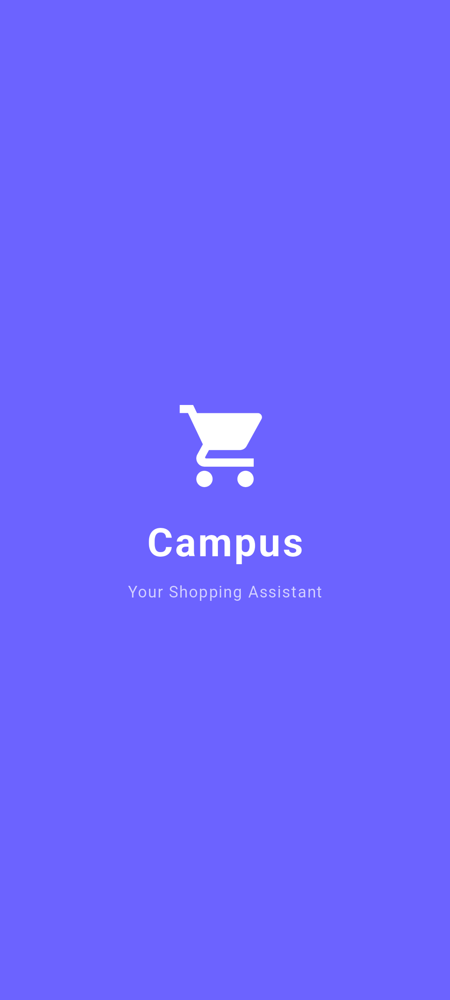
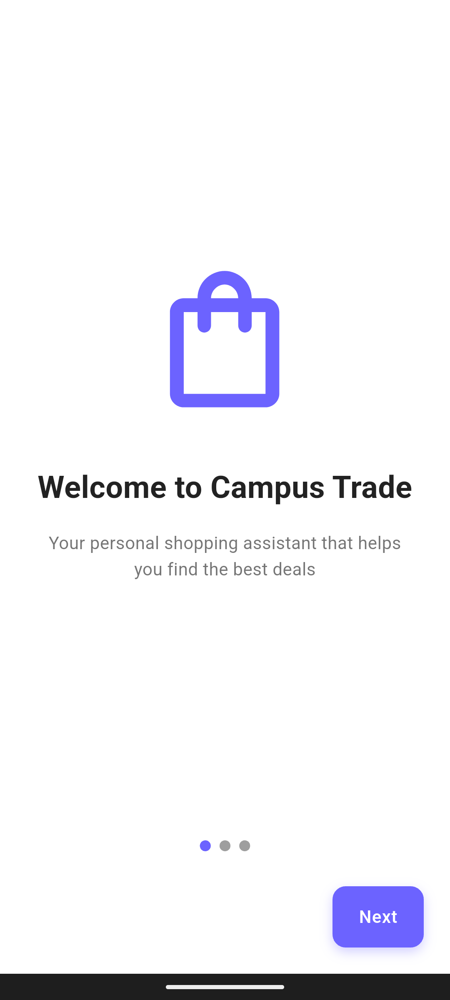
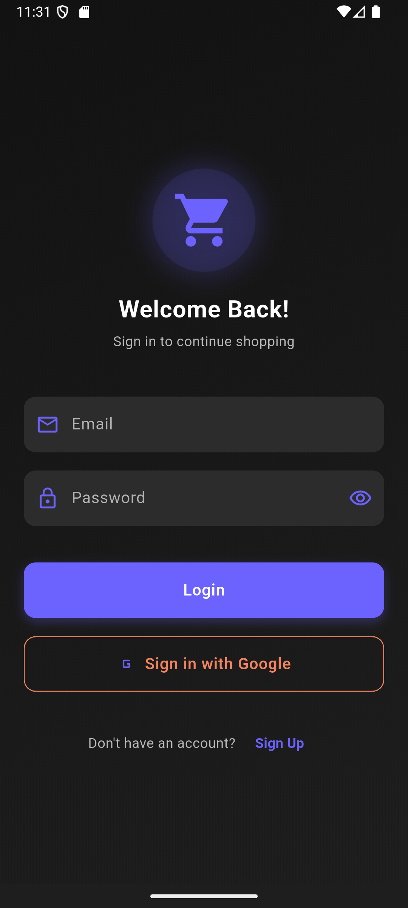
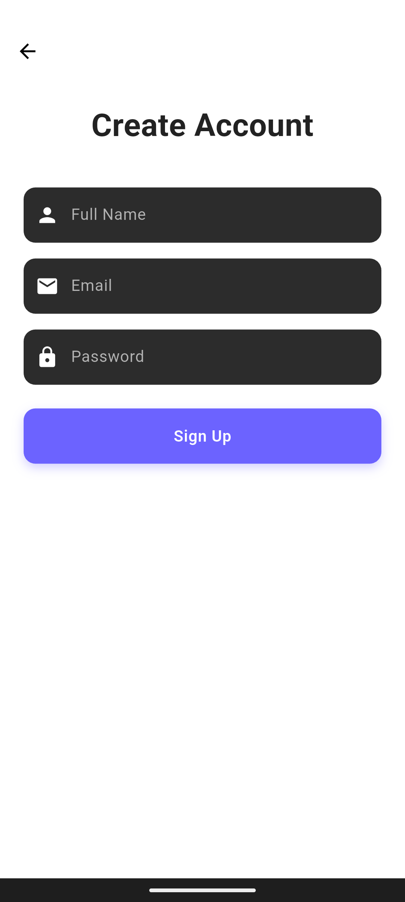
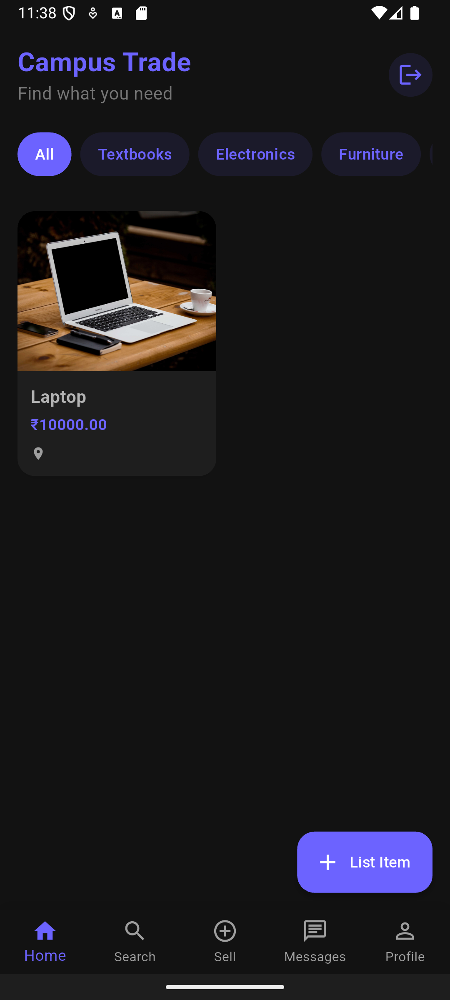
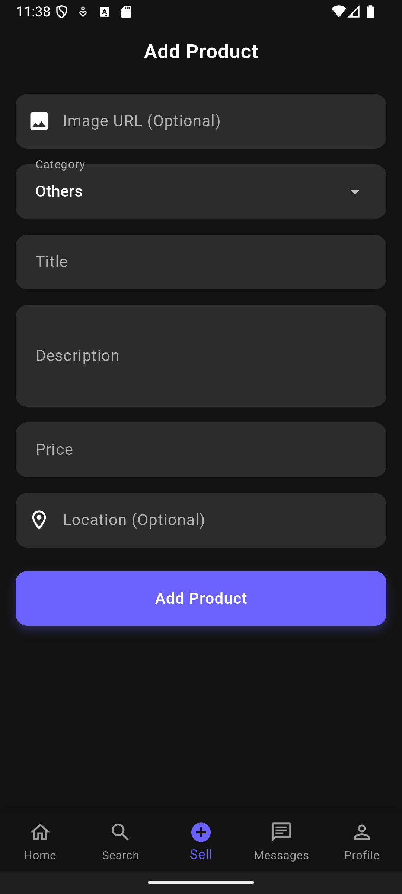

# 🎓 Campus Trade

<div align="center">

[](https://flutter.dev)
[](https://firebase.google.com)
[](https://dart.dev)

*A secure campus-exclusive marketplace for students* 🚀

Connect, Trade, and Thrive in Your Campus Community! 🌟

</div>

## ✨ Implemented Features

### 🔐 Authentication
- 📧 Email/Password Sign Up and Login
- 🔄 Google Sign-In Integration
- 💾 Persistent Login State
- 🔒 Secure Authentication Flow

### 🏪 Marketplace Features
- 📚 List and Browse Products
- 💰 Set Custom Prices
- 📝 Detailed Product Descriptions
- 🏷️ Category-based Organization
- 📍 Optional Location Information
- 💫 Real-time Product Updates
- 🔍 Product Status Tracking (Active/Sold)

### 🎨 User Interface
- 🌙 Modern Dark Theme
- 📱 Responsive Design
- 🎯 Intuitive Navigation
- ⚡ Real-time Updates
- 🔄 Smooth State Management
- 🎨 Clean and Modern UI

### 👤 User Profiles
- 👥 User Profiles with Ratings
- 📊 User Statistics
- 📈 Active Listings Count
- 💰 Sales Tracking
- ⭐ Rating System

### 💼 Product Management
- ✏️ Create Product Listings
- 🖼️ Image URL Support
- 📝 Edit Product Details
- 🗑️ Delete Products
- 💰 Price Management
- 📍 Location Tagging

### 🔍 Search & Filter
- 🔎 Product Search
- 🏷️ Category Filtering
- 💰 Price Range Filtering
- 📅 Sort by Date
- 🔄 Real-time Results

## 📱 App Screenshots

<div align="center">

### 🚀 Onboarding Experience

<table>
  <tr>
    <td width="33%">
      
      <br />
      <em>Splash Screen</em>
    </td>
    <td width="33%">
      
      <br />
      <em>Introduction Screen</em>
    </td>
    <td width="33%">
      
      <br />
      <em>Login Screen</em>
    </td>
  </tr>
</table>

### 🏪 Core Features

<table>
  <tr>
    <td width="33%">
      
      <br />
      <em>Sign Up Screen</em>
    </td>
    <td width="33%">
      
      <br />
      <em>Home Feed</em>
    </td>
    <td width="33%">
      
      <br />
      <em>Add Product</em>
    </td>
  </tr>
</table>

</div>

> Note: The app features a modern dark theme design optimized for both aesthetics and usability.

## 📲 Try the App

Want to try the app without setting up the development environment? Download our latest release!

### Direct Download
- 📱 [Download APK](https://github.com/PATELJAY31/trade_final/blob/main/app-release.apk)
- 🔄 Version: 1.0.0
- 📦 Size: ~21MB

### Installation Instructions
1. Download the APK file
2. Enable "Install from Unknown Sources" in your Android settings
3. Open the downloaded APK file
4. Follow the installation prompts
5. Launch Campus Trade and start exploring!

> Note: This app is currently available for Android devices only.

## 🚀 Getting Started

### 📋 Prerequisites
```
📱 Flutter SDK (3.5.0 or higher)
💻 Dart SDK (3.0.0 or higher)
🛠️ Android Studio / VS Code
🔥 Firebase account
🐙 Git
```

### ⚙️ Installation

1. **Clone the repository** 📥
```bash
git clone https://github.com/PATELJAY31/trade_final.git
cd trade_final
```

2. **Install dependencies** 📦
```bash
flutter pub get
```

3. **Configure Firebase** 🔥
- Create a new Firebase project
- Add Android app to Firebase project
- Download `google-services.json` and replace it in `android/app/`
- Enable Email/Password and Google Sign-In authentication methods
- Set up Cloud Firestore with appropriate security rules

4. **Run the app** 🚀
```bash
flutter run
```

### 🔥 Firebase Security Rules

```javascript
// 📝 Firestore rules
rules_version = '2';
service cloud.firestore {
  match /databases/{database}/documents {
    // Helper functions
    function isAuthenticated() {
      return request.auth != null;
    }
    
    function isOwner(userId) {
      return isAuthenticated() && request.auth.uid == userId;
    }

    // Products collection rules
    match /products/{productId} {
      allow read: if true;
      allow create: if isAuthenticated();
      allow update: if isAuthenticated() && 
        (resource.data.sellerId == request.auth.uid || 
         !resource.data.isSold);
      allow delete: if isAuthenticated() && 
        resource.data.sellerId == request.auth.uid;
    }

    // Users collection rules
    match /users/{userId} {
      allow read: if true;
      allow create: if isAuthenticated() && request.auth.uid == userId;
      allow update: if isOwner(userId);
      allow delete: if isOwner(userId);

      // User ratings subcollection
      match /ratings/{ratingId} {
        allow read: if true;
        allow create: if isAuthenticated();
        allow update, delete: if isOwner(userId);
      }
    }

    // Messages collection rules
    match /messages/{messageId} {
      allow read: if isAuthenticated() &&
        (resource.data.senderId == request.auth.uid ||
         resource.data.receiverId == request.auth.uid);
      allow create: if isAuthenticated() &&
        request.resource.data.senderId == request.auth.uid;
      allow update, delete: if false; // Messages cannot be modified or deleted
    }

    // Conversations collection rules
    match /conversations/{conversationId} {
      allow read: if isAuthenticated() &&
        request.auth.uid in resource.data.participants;
      allow create: if isAuthenticated() &&
        request.auth.uid in request.resource.data.participants;
      allow update: if isAuthenticated() &&
        request.auth.uid in resource.data.participants;
      allow delete: if false; // Conversations cannot be deleted

      // Messages subcollection in conversations
      match /messages/{messageId} {
        allow read: if isAuthenticated() &&
          request.auth.uid in get(/databases/$(database)/documents/conversations/$(conversationId)).data.participants;
        allow create: if isAuthenticated() &&
          request.auth.uid in get(/databases/$(database)/documents/conversations/$(conversationId)).data.participants;
        allow update, delete: if false; // Chat messages cannot be modified or deleted
      }
    }
  }
}
```

## 🤝 Community Guidelines

1. 📚 Only list items relevant to student life
2. 💯 Be honest about item condition
3. 🤝 Honor your commitments
4. 🔒 Meet in safe campus locations
5. 📝 Report suspicious activity

## 🆘 Support

Need help? We're here to assist!

- 📧 Email: jaypatel3261@gmail.com
- 🐛 Report issues on GitHub

---

<div align="center">

Made with ❤️ for Students, by Students

⭐ Star us on GitHub — it helps other students find us!

</div>
